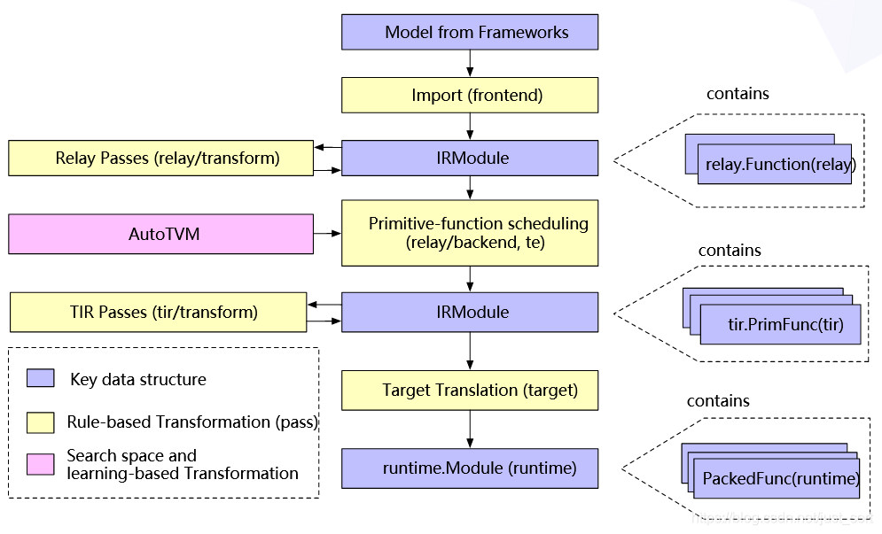

# Bert optimization based on graph compiler

## Inspiration

## Adopted optimization

* __Relay__  

In the optimization task, we will focus on hardware-independent optimization based on passes in TVM relay, including constant folding, dead-code elimination and other passes on tensor calculation like transformation, scaling factor folding, etc. 
	* Adopted passes on different levels
		- Module Level Pass
		- Function Level Pass
		- Sequential Level Pass  
	* Customized self-defined pass
	Due to a default of EliminateCommonSubexpr with reshape operator, the EliminateCommonSubexpr is customized with python decorator.

* __Auto-Scheduler__ (Something not on graph-level, but I find the joint effect interesting to test)  

Except for handicraft optimizations by pass, TVM offers the possibility to tune the scheduler automatically. Since [Ansor: Generating High-Performance Tensor Programs for Deep Learning](https://arxiv.org/pdf/2006.06762.pdf) already told us that AutoTVM might even worsen the performance for BERT if we use CPU, here I will test AutoTVM and Ansor which claims to have better performance.

* Benchmarking  

	* PyTorch  
	* Tensorflow  
	* Single pass (FoldConstant/EliminateCommonSubexpr/Customized EliminateCommonSubexpr/RemoveUnusedFunctions/ToBasicBlockNormalForm/FuseOps/CombineParallelBatchMatmul/Sequential)  
	* Auto-Scheduler (AutoTVM/Ansor)
	* Auto-scheduler on graph-optimized BERT (ex. CombineParallelBatchMatmul)

* Config  

The benchmark I have done was totally on GCP CPU instance due to a lack of ressource, and the demand of GPU will take two days for processing, but I strongly recommend to test it on GPU.

	My config:
	GCP n1-standard-8( 8 Intel Skylake vCPU, 30 GB memory)
	System: Ubuntu 16.04 LTS

* BERT tasks  

Here we focus on the inference tasks

* Results

